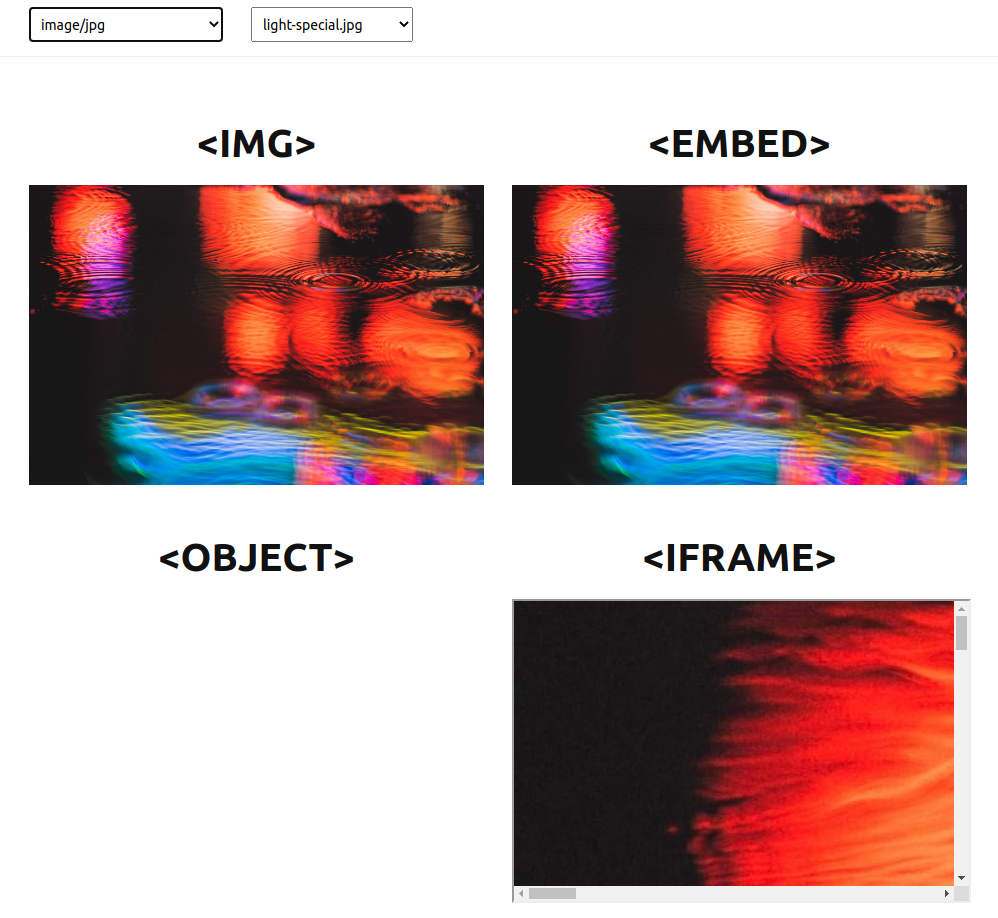

## Content-Type and HTML-Elements
Sample project how different HTML-Elements handling different content-types without specific clientside configuration using an node-express-server and sapper-framework.

### install
```
  npm install
```

### run
```
  npm run dev
```
or
```
  npm run build
  npm start
```
and open ```http://localhost:3000```

### Preview


